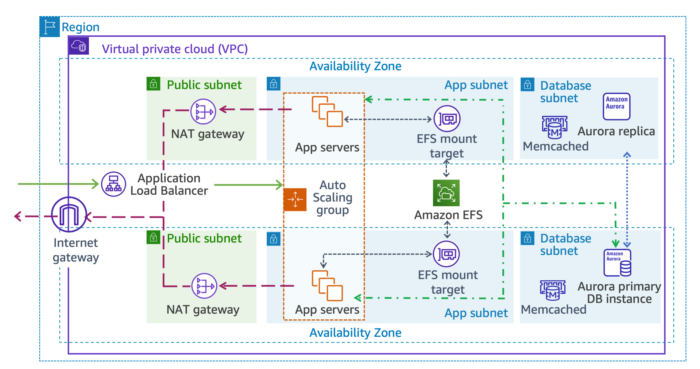

## Building Highly Available Web Application

### Lab overview

Example Corp. creates marketing campaigns for small-to-medium-sized businesses. They recently hired you to work with the engineering teams to build out a proof of concept for their business. To date, they host their clients using an on-premises data center and decided to move their operations to the cloud to save money and transform their business with a cloud-first approach. Some members of their team have cloud experience and recommended the AWS Cloud services to build their solution.

In addition, Example Corp. decided to redesign their web portal. Customers use the portal to access their accounts, create marketing plans, and run data analysis on their marketing campaigns. They would like to have a working prototype in two weeks. You must design an architecture to support this application. Your solution must be fast, durable, scalable, and more cost-effective than their existing on-premises infrastructure.

This lab showcases a mechanism to provision an auto scaling environment for a full stack web application using automation techniques to orchestrate AWS resources. IT teams can adapt this mechanism to rapidly provision infrastructure to securely deliver applications that can meet evolving business requirements.

Image description: The preceding diagram depicts the data flow from an external user to an internet gateway, though a Application Load Balancer in a public subnet, to an application server in a private subnet, to a database server in a separate private subnet.

### OBJECTIVES

After completing this lab, you should be able to do the following:

* Deploy a virtual network spread across multiple Availability Zones in a Region using a provided CloudFormation template.
* Create a highly available and fully managed relational database across those Availability Zones using Amazon Relational Database Service (Amazon RDS).
* Create a database caching layer using Amazon ElastiCache.
* Use Amazon Elastic File System (Amazon EFS) to provision a shared storage layer across multiple Availability Zones for the application tier, powered by Network File System (NFS).
* Create a group of web servers that automatically scales in response to load variations to complete the application tier.

### TASK 1: NAVIGATE TO THE CLOUDFORMATION CONSOLE
At the top of the page, in the unified search bar, search for and choose CloudFormation.
The CloudFormation page is displayed.

#### TASK 1.2: CREATE THE CLOUDFORMATION STACK

Run this:

`sam build -t 01-StartTemplate.yaml`

`sam deploy -g -t 01-StartTemplate.yaml`

* Set the Stack name as VPCStack
* Leave the Parameters set to the default values.
* This Stack can take up to 5 minutes to deploy the resources.

### Task 2: Create an Amazon RDS database
In this task, you deploy a highly available database for use by WordPress.

* At the top of the page, in the unified search bar, search for and choose RDS. The Amazon RDS console page is displayed.

* In the left navigation pane, choose Databases.

* Choose **Create database**

* In the Choose a database creation method section, select  **Standard create**

* In the Engine options section, configure the following:

    * For Engine type, select Aurora (MySQL Compatible).

* In the Templates section, select Production.

* In the Settings section, configure the following:

    * For DB cluster identifier, enter **MyDBCluster**

    * For Master username, enter admin

    * Select **Auto generate password**

* In the Instance configuration section:
    * For DB instance class, select Burstable classes.
    * For instance type, select db.t3.medium.

* In the Availability & durability section, for Multi-AZ deployment, select Create an Aurora Replica or Reader node in a different AZ.

* In the Connectivity section:

    * For Virtual private cloud (VPC), select LabVPC.

    * For DB subnet group, select labdbsubnetgroup.

    * For Public access, select No.

    * For VPC security group, select Choose existing. Select xxxxx-RDSSecurityGroup-xxxxx.

* Expand the  Additional configuration section and configure the following:

    * Database port: Leave the configuration at the default value.
    
    * In the Monitoring section, deselect Enable Enhanced monitoring.

* Scroll to the bottom of the page and expand the main  Additional configuration section. In the Database options section:

    * For Initial database name, enter **WPDatabase**

    * In the Encryption section, deselect Enable encryption.

    * In the Maintenance section, deselect Enable auto minor version upgrade.

    * In the Deletion protection section, deselect Enable deletion protection.

* Scroll to the bottom of the screen and choose Create database. On the Suggested add-ons for mydbcluster pop-up window, choose Close

 **Note:** Your Aurora MySQL DB cluster is in the process of launching. The cluster you configured consists of two instances, each in a different Availability Zone. The Amazon Aurora DB cluster can take up to 5 minutes to launch. Wait for the mydbcluster status to change to Available. You do not have to wait for the availability of the instances to continue.

Choose View connection details displayed on the success message border to save the connection details of your mydbcluster database to a text editor. On the Connection details to your database mydbcluster pop-up window, choose Close.

#### TASK 2.1: COPY DATABASE METADATA

* In the left navigation pane, choose Databases.

* Choose the mydbcluster link.

* Choose the Connectivity & security tab.

* Copy the endpoint value for the Writer instance to a text editor.

    **Note:** To copy the Writer instance endpoint, hover on it and choose the copy  icon.

* Choose the Configuration tab.

* Copy the Master username value to a text editor.

* For Master password, use the LabPassword value from the left side of these lab instructions.

* In the left navigation pane, choose Databases.

* Choose the mydbcluster-instance-x writer instance link.

* Choose the Configuration tab.

* Copy the DB name value to a text editor.

**Additional information:** WordPress uses its database to store articles, users, and configuration information.

### Task 3: Create an Amazon ElastiCache for Memcached
In this task, you create a database caching layer using Amazon ElastiCache. This provides a cache around the database for frequently run queries, improving HTTP response time performance and reducing strain on the database instantiated in the previous task.

At the top of the page, in the unified search bar, search for and choose ElastiCache. The Amazon ElastiCache page is displayed. In the left navigation pane, under Resources, choose Memcached caches.

* Choose Create Memcached cache

* On the Create Memcached cache page, in the Choose a cluster creation method section:

   * For Deployment option, choose Design your own cache.
   * Next, choose Standard create.

* In the Cluster info section:
   * For Name, enter **MyWPCache**

* In the Cluster settings section:
   * For Node type, select cache.t3.micro.
   * For Number of nodes, enter 2.
   * Choose Next

* In the Selected security groups section:

   * Choose Manage
   * The Manage security groups window is displayed. Select **xxx-ElastiCacheSecurityGroup-xxx** and then Choose
   * Choose Next
   
* Choose Create

### Task 4: Create an Amazon EFS file system
In this task, you provision a shared storage layer using Amazon EFS that creates an NFS cluster across multiple availability zones.

At the top of the page, in the unified search bar, search for and choose EFS. The Amazon Elastic File System page is displayed.

* Choose Create file system .

* On the Create file system page, choose Customize

* On the File system settings page, in the General section:
   * For Name, enter **myWPEFS**
   * Deselect Enable automatic backups.

* In the Tags - optional section:
   * For Tag key, enter **Name**
   * For Tag value – optional, enter **myWPEFS**
   * Leave all other settings at their default value.
   * Choose Next

* On the Network access page:
   * For Virtual Private Cloud (VPC), select LabVPC.
   * For Availability Zone, select the Availability Zone ending in “a”.
   * For Subnet ID, select AppSubnet1.
   * For Security group, select xxxxx-EFSMountTargetSecurityGroup-xxxxx
   * For Availability Zone, select Availability Zone ending in “b”.
   * For Subnet ID, select AppSubnet2.
   * For Security group, select **xxxxx-EFSMountTargetSecurityGroup-xxxxx.**
   * Choose Next

* On the File system policy – optional page, choose Next .

* On the Review and create page, scroll to the bottom of the page and choose Create .

Copy the *File system ID* generated for myWPEFS to a text editor. It has a format like fs-a1234567.

### Task 5: Create an Application Load Balancer
In this task, you create the Application Load Balancer and a target group. At the top of the page, in the unified search bar, search for and choose EC2.

* In the left navigation pane, choose Target Groups.
* Choose Create target group
* On the Specify group details page, in the Basic configuration section:
   * For Choose a target type, select Instances.
   * For Target group name, enter **myWPTargetGroup**
   * For VPC, select LabVPC.
* On the Specify group details page, in the Health checks section:
   * For Health check path, enter **/wp-login.php**

* Expand the  Advanced health check settings section and configure the following:
   * For Healthy threshold, enter 2.
   * For Unhealthy threshold, enter 10.
   * For Timeout, enter 50.
   * For Interval, enter 60.

* Leave the remaining settings on the page at their default values. Choose Next

* On the Register targets page, scroll to the bottom of the page and choose Create target group .

#### TASK 5.1: CREATE AN APPLICATION LOAD BALANCER
In the left navigation pane, choose Load Balancers. Choose Create load balancer. 

* In the Application Load Balancer section, choose Create
* For Load balancer name, enter **myWPAppALB**

* On the Create Application Load Balancer page, in the Network mapping section:
   * For VPC, choose LabVPC.

For Mappings:
   * Select the first Availability Zone listed, and choose **PublicSubnet1** from the Subnet dropdown menu.
   * Select the second Availability Zone listed, and choose **PublicSubnet2** from the Subnet dropdown menu.

* In the Security groups section:
   * From the Security groups dropdown menu, choose **xxxxx-AppInstanceSecurityGroup-xxxxx**
   * To remove the default security group, choose the X.

* In the Listeners and routing section:
   * For Listener HTTP:80, choose myWPTargetGroup for the Default action.

* Scroll to the bottom of the page and choose **Create load balancer**

Copy the DNS name to a text editor.

**WARNING:** Verify that all the resources from previous tasks are created successfully before continuing to the next task. Wait for the load balancer State to change to Active.

### Task 6: Create a launch template using CloudFormation

In this task, you use SAM to deploy the WordPress user data within an Amazon Elastic Compute Cloud (Amazon EC2) Auto Scaling launch template. The template includes the EFS mount points and the Aurora configurations.

Run this:

`sam build -t 02-WPLaunchConfigStack.yaml`

`sam deploy -g -t 02-WPLaunchConfigStack.yaml`

* For stack name enter **WPLaunchConfigStack**
* In the Parameters section, for DB Name, paste the initial database name you copied in Task 2. **Note:** Make sure that you paste the initial database name, not the cluster name.
* For Database Host Name, paste the writer endpoint you copied in Task 2.
* For Database User Name, paste the Master username you copied in Task 2.
* For Database Password, paste the LabPassword value from the left side of these lab instructions.
* For WordPress admin username, defaults to **wpadmin**
* For WordPress admin password, paste the LabPassword value from the left side of these lab instructions.
* For WordPress admin email address, input a valid email address.
* For Instance Type, leave the default value of t3.medium.
* For ALBDnsName, paste the DNS name value you copied in Task 5.
* For LatestAL2AmiId, leave the default value.
* For WPElasticFileSystemID, paste the File system ID value you copied in Task 4.

Wait for the stack status to change to  CREATE_COMPLETE. **Note:** This stack can take up to 5 minutes to deploy the resources.

### Task 7: Create the application servers by configuring an Auto Scaling group and a scaling policy
In this task, you create the WordPress application servers by configuring an Auto Scaling group and a scaling policy.  At the top of the page, in the unified search bar, search for and choose EC2. In the left navigation pane, under the Auto Scaling section, choose Auto Scaling Groups.

* Choose Create Auto Scaling group

* On the Choose launch template or configuration page:
   * In the Name section, for Auto Scaling group name, enter **WP-ASG**
   * In the Launch template section, for Launch Template, select LabLaunchTemplate.

* Choose Next

* On the Choose instance launch options page, in the Network section:
   * For VPC, select LabVPC.
   * For Availability Zones and subnets, choose **AppSubnet1** and **AppSubnet2**

* Choose Next

* On the Configure advanced options page, configure the following:
   * For Load balancing, select Attach to an existing load balancer.
   * For Attach to an existing load balancer, select Choose from your load balancer target groups.
   * For Existing load balancer target groups, select **myWPTargetGroup | HTTP**
   * For Health checks, select Turn on Elastic Load Balancing health checks.
   * For Health check grace period, leave at the default value of 300 or more.
   * For Monitoring, select Enable group metrics collection within CloudWatch.

* Choose Next

* On the Configure group size and scaling - optional page:
   * In the Group Size section, for Desired capacity, enter 2.
   * In the Scaling section:
   * For Minimum capacity, enter 2
   * For Maximum capacity, enter 4

* In the Automatic scaling - optional section, select the **Target tracking scaling policy option**. The remaining settings on this section can be left at their default values.

* Choose Next

* In the Add notifications page, choose Next

* In the Add tags page, choose Add tag and in the Tags (1) section:
   * For Key, enter **Name**
   * For Value, enter **wp-ha-app**

* Choose Next

* On the Review page, review the Auto Scaling group configuration for accuracy, and then at the bottom of the page, choose Create Auto Scaling group .

Now that you have created your Auto Scaling group, you can verify that the group has launched your EC2 instances. Choose the Auto Scaling group WP-ASG link. To review information about the Auto Scaling group, examine the Group Details section.

Choose the Activity tab. The Activity History section maintains a record of events that have occurred in your Auto Scaling group. The Status column contains the current status of your instances. When your instances are launching, the status column shows PreInService. The status changes to Successful once an instance is launched.

Choose the Instance management tab. Your Auto Scaling group has launched two Amazon EC2 instances and they are in the InService lifecycle state. The Health Status column shows the result of the Amazon EC2 instance health check on your instances. If your instances have not reached the InService state yet, you need to wait a few minutes. You can choose the refresh button to retrieve the current lifecycle state of your instances.

Choose the Monitoring tab. Here, you can review monitoring-related information for your Auto Scaling group. This page provides information about activity in your Auto scaling group, as well as the usage and health status of your instances. The Auto Scaling tab displays Amazon CloudWatch metrics about your Auto Scaling group, while the EC2 tab displays metrics for the Amazon EC2 instances managed by the Auto Scaling group.

In the left navigation pane, choose Load Balancers. Copy the DNS name to a text editor and append the value /wp-login.php to the end of the DNS name to complete your WordPress application URL.

* Paste the WordPress application URL value into a new browser tab. The WordPress login page is displayed.
* On the WordPress login page:
   * For Username or Email Address, enter wpadmin.
   * For Password, paste the LabPassword value from the left side of these lab instructions.
   * Choose the Log in button. The WordPress management website is displayed.

 **Note:** Keep the browser tab open, you will return to it in later task.

### Task 8: Chaos testing with AWS Fault Injection Simulator
In this task, you test the application high availability using chaos engineering. You randomly terminate EC2 instances and see if the auto scaling group and load balancer can reroute the traffic to healthy hosts and start new EC2 instances to keep the required capacity.

 Additional information: However, turning off EC2 instances manually is not a scalable solution. You use the AWS Fault Injection Simulator to automate this test.

#### TASK 8.1: NAVIGATE TO THE CONSOLE
At the top of the page, in the unified search bar, search for and choose AWS FIS.
The AWS FIS page is displayed.

#### TASK 8.2: TEST SCENARIO AND ASSUMPTIONS
 Additional information: To run a successful fault injection test you need to form an assumption and test it. The assumption for this experiment is:

 Example: If one of the Availability Zone (AZ) has an outage, and all the EC2 in that AZ stops, our web application remains available. The load balancer routes the traffic to other AZs and the auto scaling group starts new EC2s to keep the required number of instances.

From Create experiment from scenario drop-down menu, choose Create experiment template .

On the Account targeting pop-up page, choose the option This AWS account and choose Confirm .

On the Create experiment template page, in the Description and name section:

For Description, enter Terminate instances in an AZ to simulate AZ outage
For Name - optional, enter TerminateInstancesinAZ
In the Actions section:
Choose Add action .
For Name, enter TerminateInstances
For Action type, select EC2 and aws:ec2:terminate-instances.
Choose Save .
In the Targets section, configure:
Choose Edit .

For Target method, select Resource tags, filters and parameters.

For Resource tags:

Choose Add new tag .
For Key, enter Name
For Value, enter wp-ha-app
For Resource filters - optional:

Choose Add new filter .

For Attribute path, enter Placement.AvailabilityZone

For Values, enter LabRegion appended with “a” at the end.

 Expected value: us-west-2a

Choose Add new filter .

For Attribute path, enter State.Name
For Values, enter running.
Choose Save .

In the Service Access section, configure:
Select Use an existing IAM role.
For IAM role, select xxxx-FISRole-xxxx.
Choose Create experiment template .
The Create experiment template window is displayed.

For To confirm that you want to create an experiment template without a stop condition, enter create in the field, enter create.

Choose Create experiment template .

 Expected service output:

 You successfully created experiment template EXT9VzxxxxX / Terminate instances in an AZ to simulate AZ outage.

#### TASK 8.3: START THE EXPERIMENT
In the left navigation pane, choose Experiment templates.

Choose the Experiment template ID link.

Choose Start experiment .

Choose Start experiment .

The Start experiment window is displayed.

For To confirm that you want to start the experiment, enter start in the field:, enter start.

Choose Start experiment .

 Expected service output:

 You successfully started experiment EXPU8kxxxxxE2.

 Note: Wait for the State to change to Completed.

#### TASK 8.4: OBSERVE THE EXPERIMENT
Return to the WordPress website browser tab and refresh  the page every few seconds.
 Expected output: The website should continue to load correctly.

Return to the AWS Management Console and search for EC2.

In the left navigation pane, choose Auto Scaling Groups.

Select WP-ASG.

Choose the Activity tab.

 Expected output: You should start to see that the EC2 instance in availability zone ending in “a” was taken out of service. It might take a few minutes for the health check to detect the EC2 is unhealthy, so keep refreshing the Instance list. You should also see new instances being launched by the auto scaling group to replenish the lost capacity.

 Congratulations! You have successfully conducted the experiment, the WordPress site remained functional. The website auto-healed from the AZ outage and website is back to the desired capacity in just a few minutes. This verifies highly-available architecture is working as intended.

### Challenge yourself!
#### SPEEDUP THE WORDPRESS WEBSITE

Add a content delivery network using SAM to speed up global delivery of the WordPress application then replace the Site Address (URL) with the CloudFront DNS hostname and view the public facing WordPress site created in this lab.

*Additional information: Amazon CloudFront can speed up the delivery of your websites, whether its static objects (e.g., images, style sheets, JavaScript, etc.) or dynamic content (e.g., videos, audio, motion graphics, etc.), to viewers across the globe. The CDN offers a multi-tier cache by default that improves latency and lowers the load on origin servers when the object is not already cached at the Edge. The CloudFront distribution caches the content, improves latency for users across the globe and lowers the load on origin WordPress servers.*

Run this:

`sam build -t 03-WPCloudFrontStack.yaml`

`sam deploy -g -t 03-WPCloudFrontStack.yaml`

Configure the following parameters:

* For CloudFront Certificate ARN, leave this optional parameter empty.
* For Domain name, leave this optional parameter empty.
* For ALBDnsName, paste the load balancer DNS name value you copied in Task 4.
* Wait for the stack status to change to  CREATE_COMPLETE .

**Note:** This stack can take up to 5 minutes to deploy the resources.

* Copy the DnsHostname value to a Text Editor.
* Login to WordPress Admin console
* Return to WordPress Management site.
* In the left menu, navigate to Settings > General tab.
* Replace the Site Address(URL) with the DNSHostname copied earlier.
* Browse to the CloudFront DNS name to view the public facing WordPress site.
